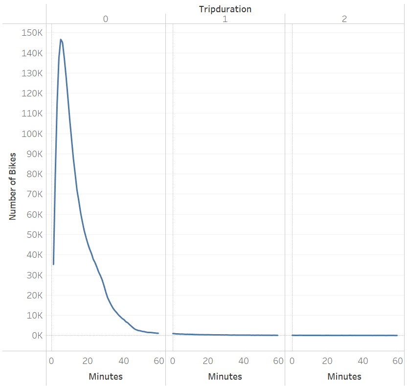
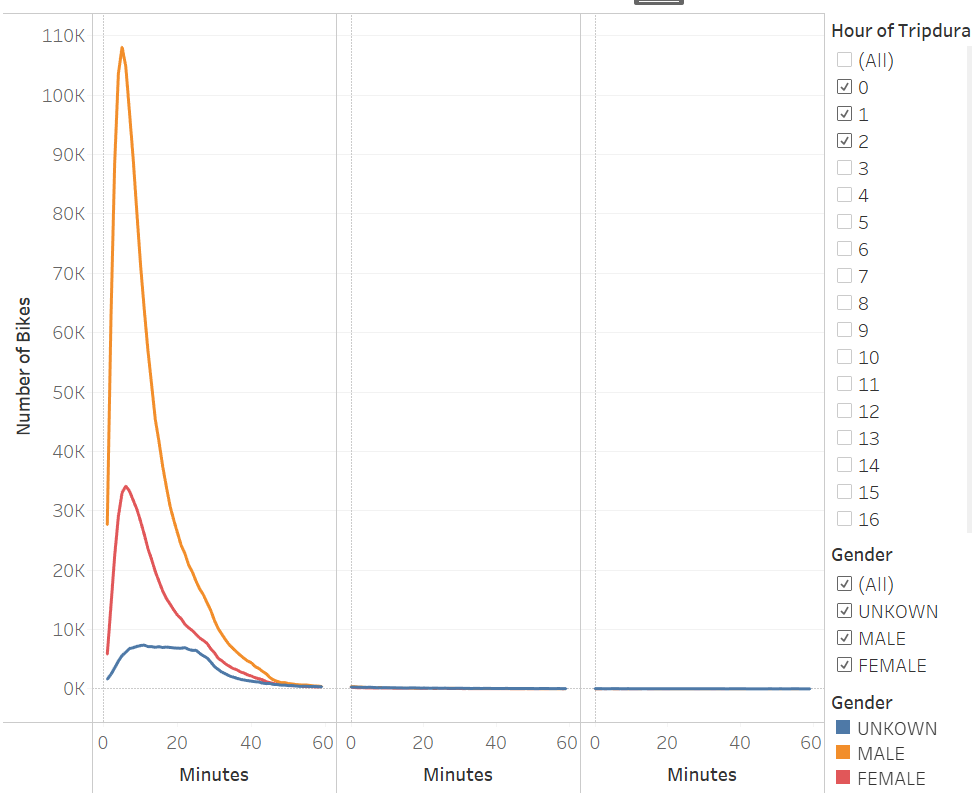
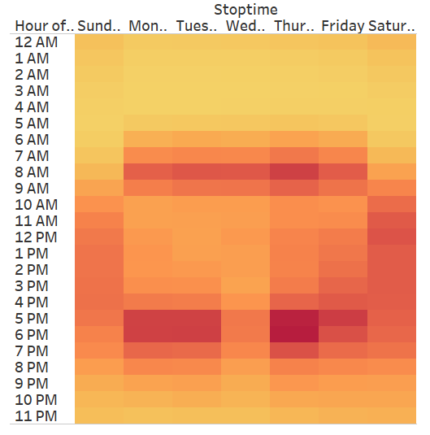
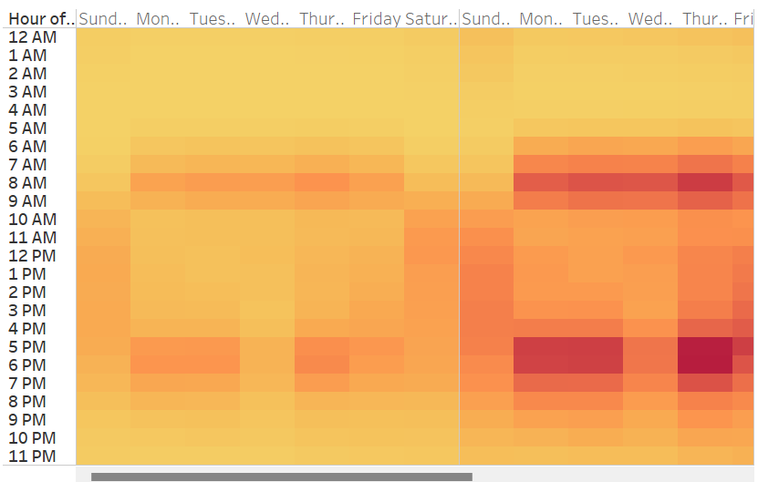
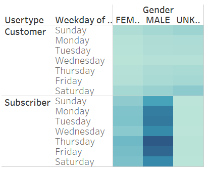

# bikesharing

## Purpose

The purpose of this analysis was to determine how often the bikes were used, which gender used the bikes most often, and which gender is most subscribed to the bike service.

## Results

Most bike trips last about 10 minutes.

More males than females ride the bikes. The trip duration is about the same.

On weekdays, 8 AM is a popular time. 5-7 PM is also a popular time on weekdays, except for Wednesday. 
During the weekends, 11 AM to 6 PM is the most popular time.

There is no difference in popular time between genders. Overall more men use the bikes than women.

More men are subscribed to the bikesharing service than women.

[link to dashboard](https://public.tableau.com/app/profile/hamza5755/viz/NYC_Citibike_Challenge_16633665412610/Story1?publish=yes)
